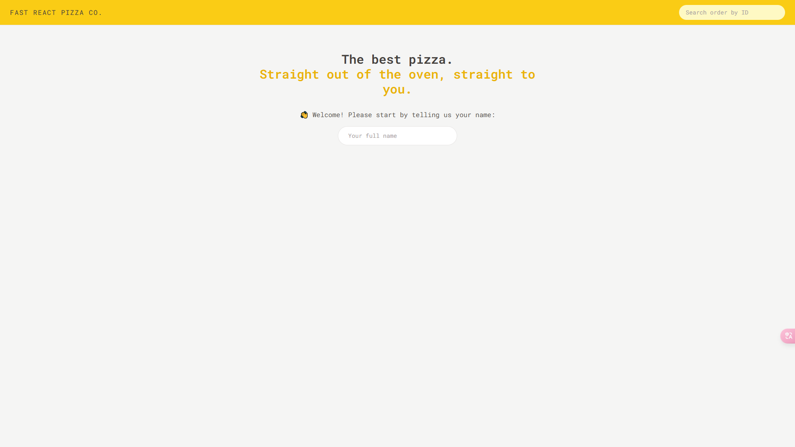
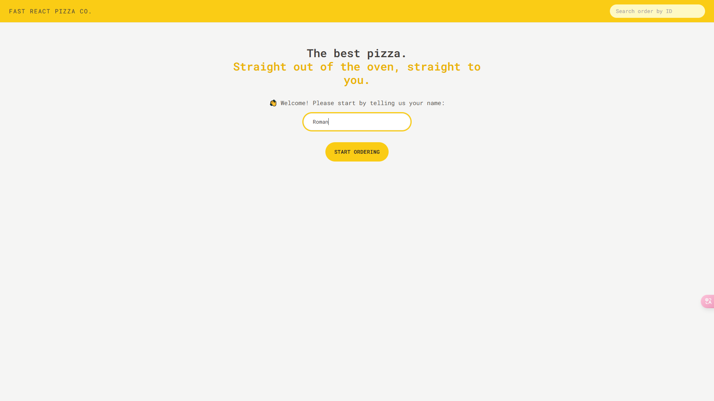
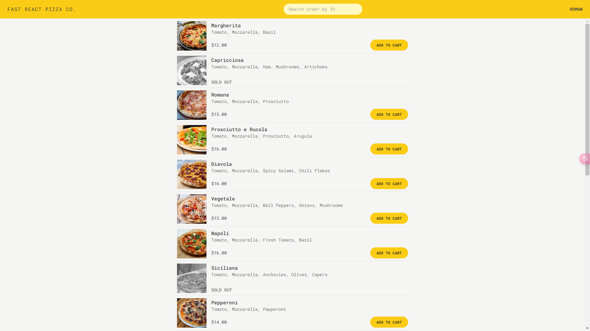
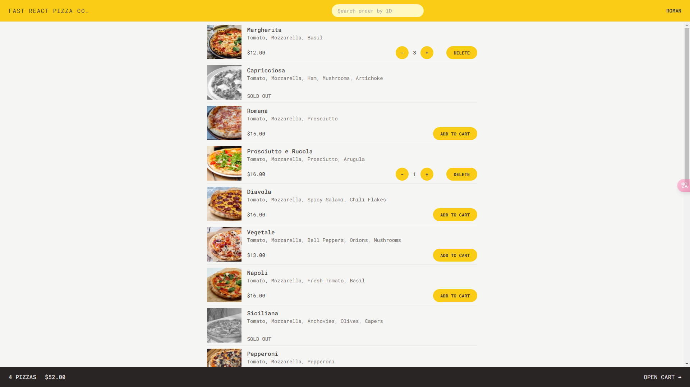
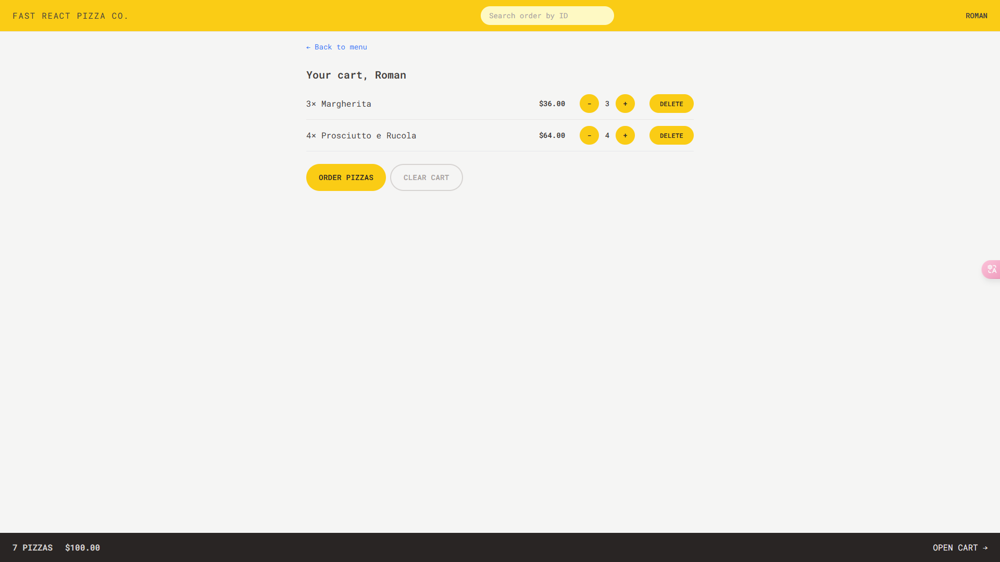
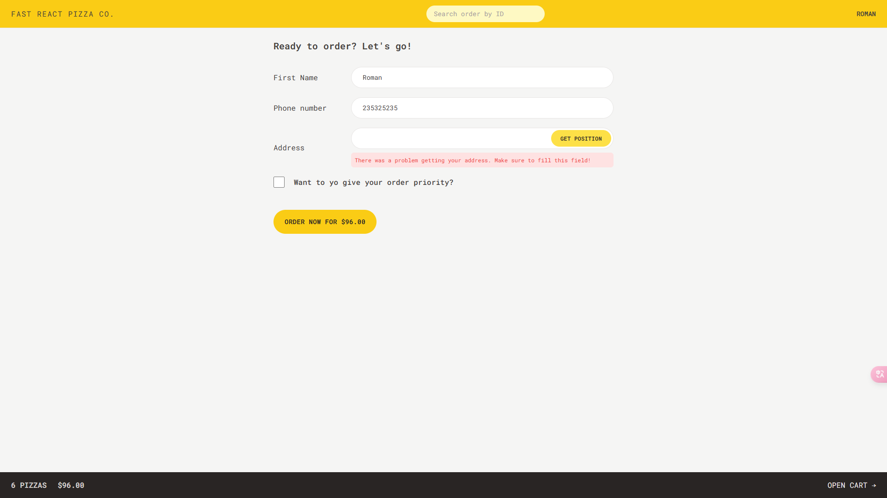
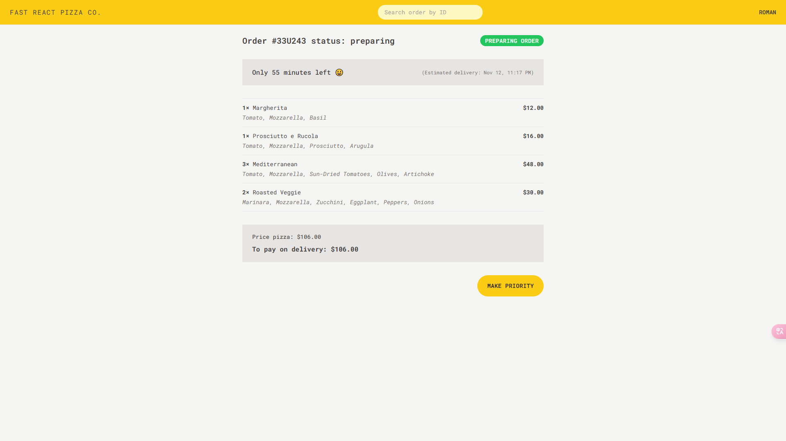
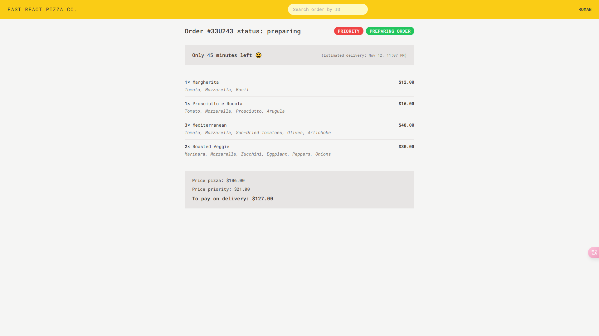

# Fast React Pizza App

## Tools used:

- Vite
- React 18
- React Router 6.4
- TailwindCSS
- Mobile First
- useNavigation Hook
- Redux Thunk middleware (createAsyncThunk)
- Geolocation API
- useFetcher Hook (react-router v6.4)

<!-- [Link to project](https://world-wise-nine-neon.vercel.app/) -->
